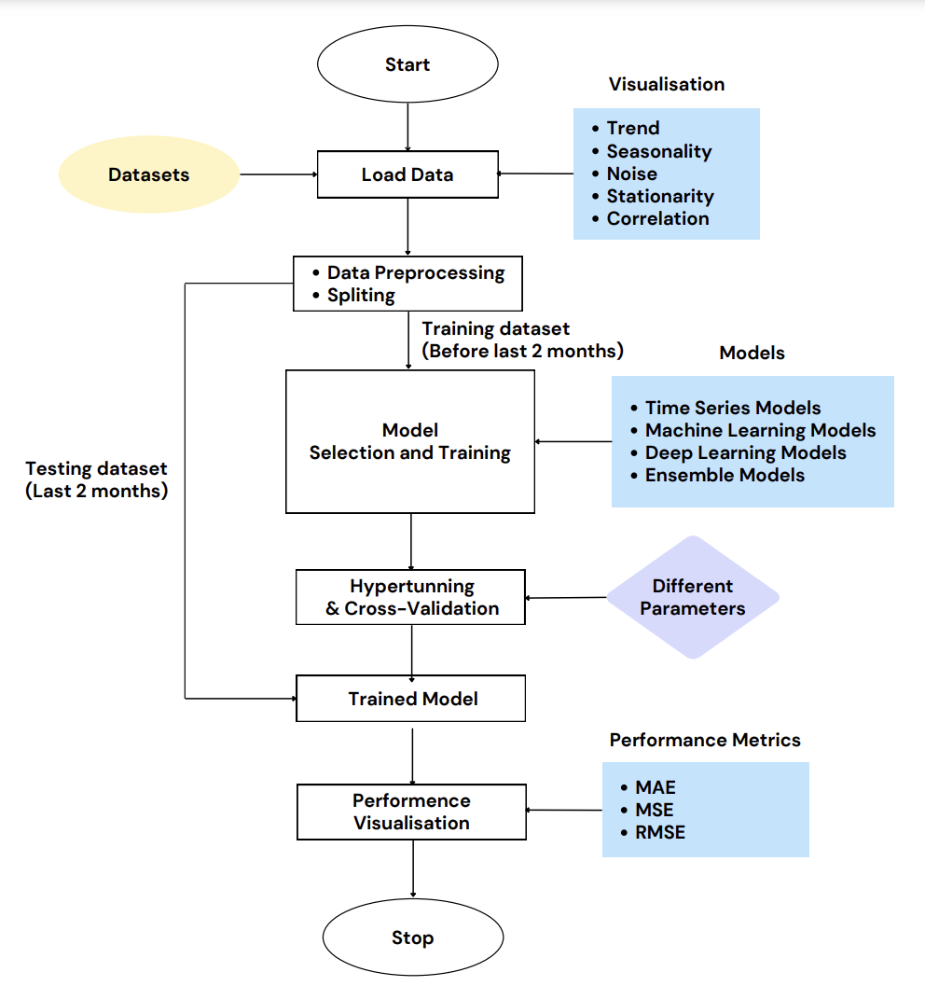

# Weather Time Series Prediction Project

A comprehensive time series analysis project implementing multiple forecasting approaches to predict weather conditions at various future intervals (5min-12hrs) using data collected from a Raspberry Pi in Newcastle. Features traditional time series methods, machine learning models, deep learning, and ensemble approaches.

## Project Workflow

The project follows a structured workflow with key stages:
1. **Data Loading & Preprocessing**
   - Time standardisation
   - Data resampling
   - Train-test splitting
2. **Model Development**:
   - Time series models
   - Machine learning models
   - Deep learning approach
   - Ensemble methods
3. **Evaluation & Comparison**

## Key Features
### Time Series Techniques
- Data decomposition
- Stationarity testing (ADF)
- ACF/PACF analysis
- Traditional models:
  - ARIMA
  - HWES (Holt-Winters Exponential Smoothing)

### Machine Learning Models
- Linear Models:
  - Lasso Regression
  - Bayesian Ridge Regression
- Tree-Based Models:
  - Random Forest
  - XGBoost
- Support Vector Regression (SVR)
- Long Short-Term Memory (LSTM)

### Ensemble Methods
- Average Ensemble
- Weighted Average Ensemble
- Stacking Ensemble

## Technical Stack
### Core Technologies
- Python
- TensorFlow/PyTorch
- scikit-learn

### Key Libraries
- pandas: Time series data handling
- numpy: Numerical operations
- statsmodels: Time series analysis
- scikit-learn: Machine learning models
- TensorFlow/PyTorch: LSTM implementation
- matplotlib/seaborn: Data visualization

### Implementation Techniques
- Time series preprocessing
- Cross-validation
- Hyperparameter tuning
- Model ensembling
- Performance metrics evaluation

## Model Comparison

| Category | Model | MAE | MSE | RMSE |
|----------|-------|-----|-----|------|
| Time Series | ARIMA | 0.62 | 2.34 | 0.82 |
| Time Series | HWES | 0.39 | 1.39 | 0.60 |
| Linear | Lasso | 3.37 | 15.90 | 3.98 |
| Linear | Tuned Lasso | 3.37 | 15.90 | 3.98 |
| Linear | Bayesian Ridge | 3.37 | 15.89 | 3.98 |
| Linear | Tuned Bayesian Ridge | 3.37 | 15.89 | 3.98 |
| Tree-Based | XGBoost | 4.42 | 28.15 | 5.31 |
| Tree-Based | Tuned XGBoost | 4.70 | 30.90 | 5.56 |
| Tree-Based | Random Forest | 5.10 | 38.05 | 6.17 |
| Tree-Based | Tuned Random Forest | 4.90 | 30.51 | 5.52 |
| Deep Learning | LSTM | 0.10 | 0.02 | 0.12 |
| Ensemble | Average | 5.50 | 40.20 | 6.34 |
| Ensemble | Weighted Average | 5.76 | 43.83 | 6.62 |
| Ensemble | Stacking | 4.72 | 31.03 | 5.57 |

## Model Performance Insights

### Time Series Models (ARIMA, HWES)
- Strong baseline performance with low error metrics
- HWES outperformed ARIMA across all metrics
- Particularly effective for short-term predictions
- Well-suited for capturing seasonal patterns

### Linear Models (Lasso, Bayesian Ridge)
- Consistent but moderate performance
- Minimal improvement from hyperparameter tuning
- Similar performance across different linear models
- Reasonable choice for computational efficiency

### Tree-Based Models (XGBoost, Random Forest)
- Higher error rates compared to simpler models
- Tuning improved Random Forest performance
- XGBoost showed better base performance
- Potential overfitting despite regularization

### Deep Learning (LSTM)
- Outstanding performance across all metrics
- Significantly lower error rates (MAE: 0.10, RMSE: 0.12)
- Best suited for capturing complex temporal patterns
- Computationally intensive but justified by results

### Ensemble Methods
- Surprisingly higher error rates than individual models
- Stacking performed better than simple averaging
- Weighted averaging did not improve performance
- Complex ensembling didn't yield expected benefits

### Key Findings
1. **Best Overall Model**: LSTM demonstrated superior performance with lowest error metrics
2. **Computational Trade-off**: Time series models offer excellent performance with lower computational cost
3. **Ensemble Limitations**: Ensemble methods didn't improve upon individual model performance
4. **Tuning Impact**: Hyperparameter tuning showed minimal improvement for most models
5. **Complexity vs Performance**: Simpler time series models outperformed complex machine learning approaches
